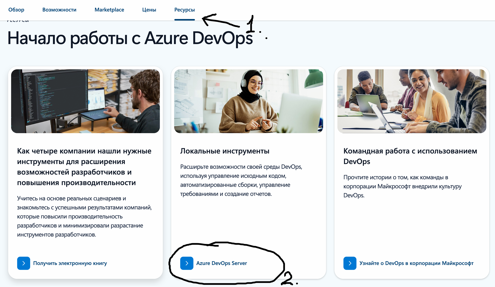
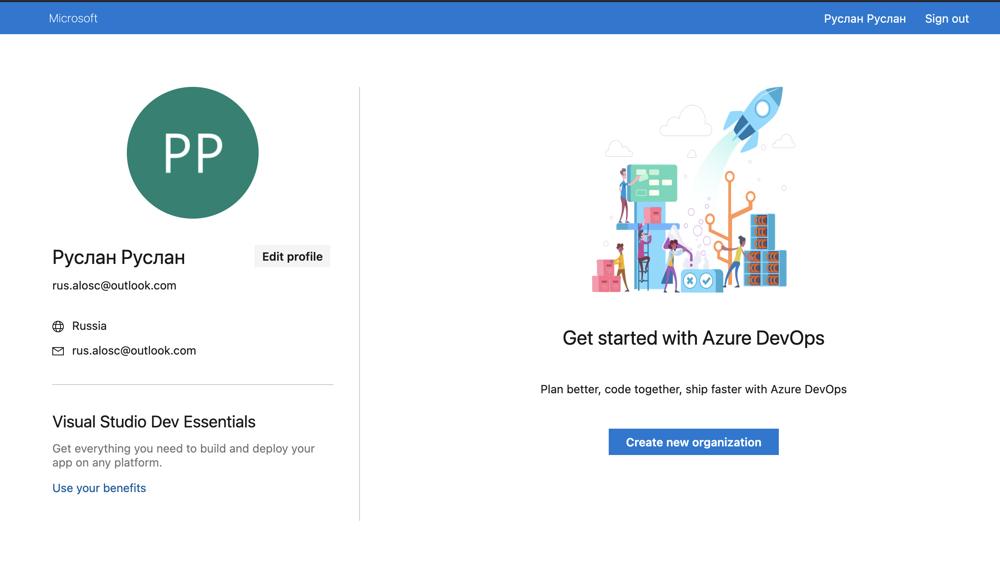
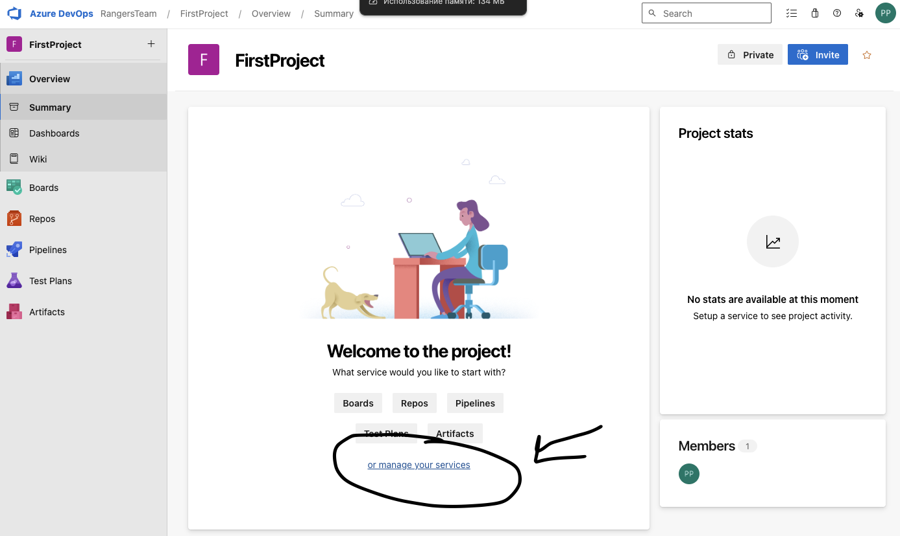
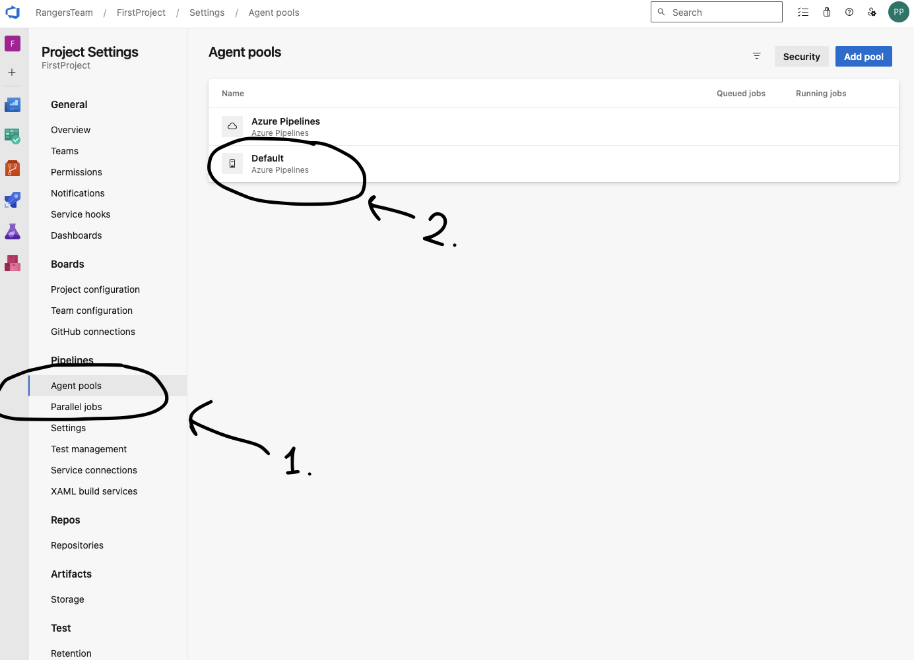
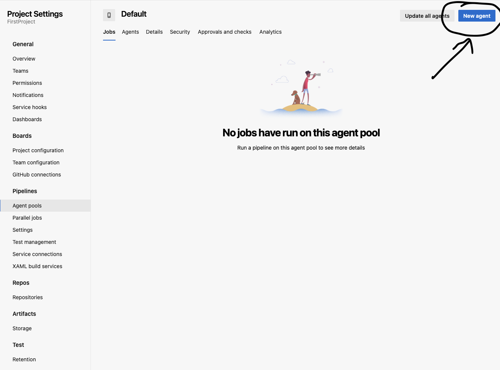
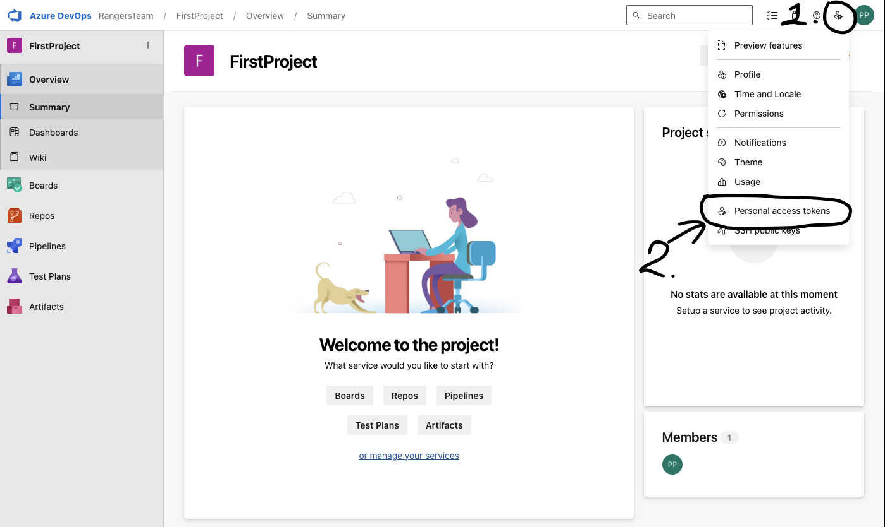
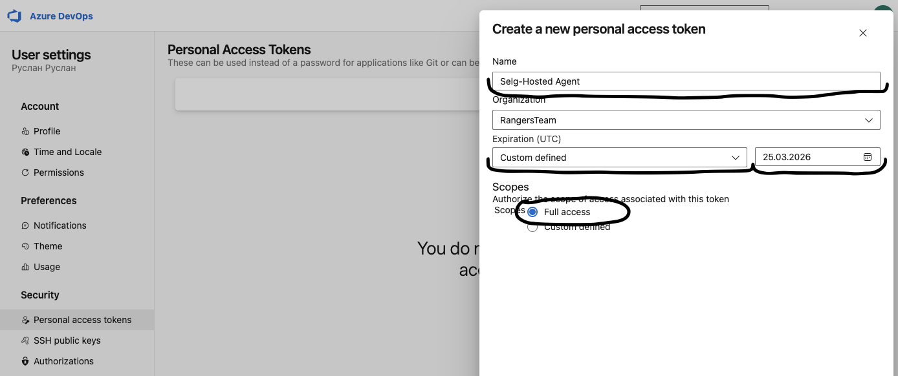

>Привет всем тем, кто не разобрался, как создавать и настраивать Azure DevOps, а также во всём, что с ним связано.

#*Задача 1: Создать компанию*  
>Чтобы создать организацию в Azure DevOps, перейдите на [Azure DevOps](https://dev.azure.com/), нажмите «Попробовать бесплатно» — и осознайте, что теперь вы застряли в лабиринте настроек без выхода.  

>Начнём настройку нашего аккаунта по полкам.  
>1.Создаем почту для входа в Azure DevOps  
>>1.Перейдите на [Outlook](https://outlook.live.com)(ссылка кликабельна).  
>>2.Прокрутите страницу немного вниз и нажмите «Создать бесплатную учетную запись».  
>>3.Заполните все обязательные поля.  
>>4.В пункте «Страна» выберите ОАЭ (Объединенные Арабские Эмираты).  

>2.Переходим на сайт: [Azure DevOps](https://dev.azure.com/)  
>>1.Прокручиваем чуть ниже  
  
>>2.Нажимаем на пункт (2)  
>>3.После перехода на другую страницу нажимаем «Начать бесплатно».  
>>4.Регистрируемчя по логину Outlook и паролю соответсвенно, после попадаем на страницу создания аккуанта в Azure DevOps.  
  
>>5.Нажимаем создать организацию.  
>>6.После создаете проект.  

>3.Настройка pool agenta  
  
  
  
>>После нажатия на new agent следуете инструкциям указанные на странице  
>>Для разархивировании на *Mac OS* необходимо написать команду  
`tar zxvf ~/Downloads/vsts-agent-osx-arm64-4.252.0.tar.gz`  
>>Далее следуем инструкция из [Методички](https://github.com/CodeHunterOfficial/ABC_DataMining/blob/main/Python/%D0%9F%D0%BE%D0%B4%D1%80%D0%BE%D0%B1%D0%BD%D0%BE%D0%B5_%D1%80%D1%83%D0%BA%D0%BE%D0%B2%D0%BE%D0%B4%D1%81%D1%82%D0%B2%D0%BE_%D0%BF%D0%BE_%D0%BD%D0%B0%D1%81%D1%82%D1%80%D0%BE%D0%B9%D0%BA%D0%B5_Self_Hosted_%D0%B0%D0%B3%D0%B5%D0%BD%D1%82%D0%B0_%D0%B4%D0%BB%D1%8F_Azure_DevOps.ipynb)  
>>После достижения 4-го шага следуем моим инструкциям:  

>4.Создание Personal Access Token (PAT)  
>>Следуем инстукциям из фото ниже  
  
>>После перехода нажимаем кнопку *New Token*    
  
>>На этом фото можете изменить поле Name, а все остальное желательно повторить как в оригинале  
>>На экране появляется токен, скопируйте и не теряйте, *просмотреть его ещё раз не будет возможности*  
>>Если вы работаете на *Mac OS* лучше реально сохраните где-нибудь  
>>Чтобы запустить agent на *Mac OS* достаточно написать `./run.sh`

